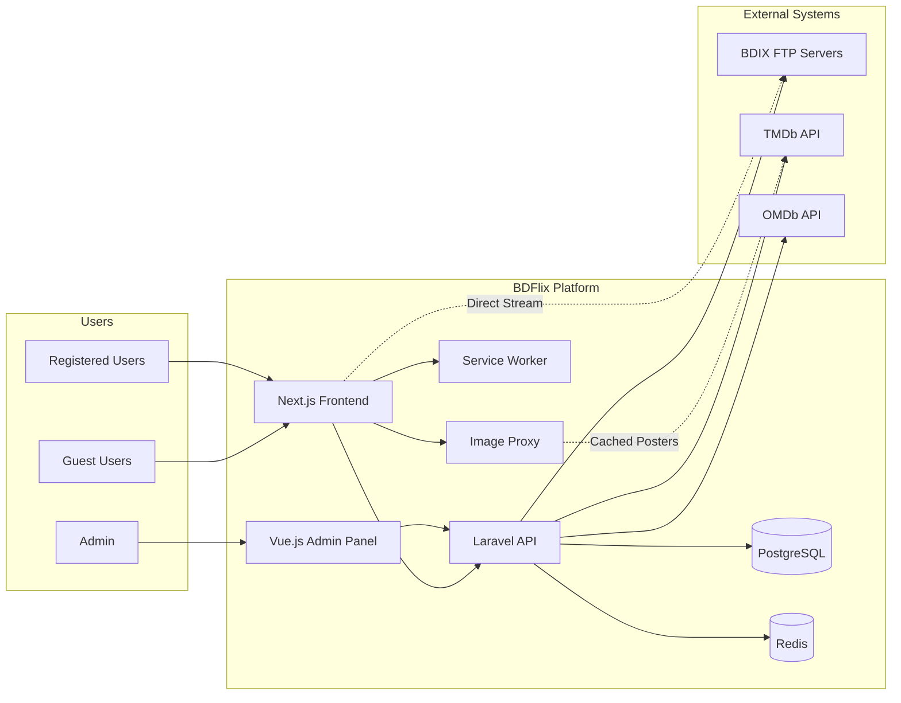

 # BDFlix — Software Requirements Specification (SRS)

**Version**: 2.0  
**Date**: 2026-02-18  
**Author**: Iftekhar Tasnim  
**Status**: Draft  
**Reference**: [BRD v1.0](file:///Volumes/WD%20M.2/BluBird/BDFlix/docs/BRD.md) | [Project Plan v1.1](file:///Volumes/WD%20M.2/BluBird/BDFlix/docs/project_plan.md)

---

## 1. Introduction

### 1.1 Purpose

This SRS defines the functional and non-functional requirements for **BDFlix** — a free, full-stack movie and TV series streaming platform aggregating content from Bangladesh BDIX FTP servers.

### 1.2 Scope

BDFlix consists of three deployable components:
1. **Backend API** (Laravel 11) — REST API, two-phase content scanning, metadata enrichment, crowdsourced health monitoring
2. **Frontend** (Next.js 14) — User-facing streaming interface with ISP-based source detection, Playback Bridge, and Service Worker caching
3. **Admin Panel** (Vue.js 3) — Source, content, user management, review queue, and crowdsourced health dashboard

### 1.3 Definitions & Acronyms

| Term | Definition |
|------|-----------|
| BDIX | Bangladesh Internet Exchange |
| FTP | File Transfer Protocol |
| HLS | HTTP Live Streaming (.m3u8) |
| JWT | JSON Web Token |
| TMDb | The Movie Database API |
| OMDb | Open Movie Database API |
| Source | A BDIX FTP/media server hosting video content |
| Scraper | Module that fetches content listings from a specific source |
| ISP | Internet Service Provider |
| Collector | Phase 1 of scanning — fast file indexing without API calls |
| Enricher | Phase 2 of scanning — metadata enrichment via rate-limited API calls |
| Bridge Page | A fallback page for browser-incompatible video formats, offering VLC/PotPlayer deep links |
| Race Strategy | Simultaneous pinging of all BDIX sources to determine reachability |
| Shadow Table | Temporary database table used during scans to prevent UI sluggishness |

### 1.4 References

- BDFlix BRD v1.0
- BDFlix Project Plan v1.1
- [TMDb API Docs](https://developers.themoviedb.org/3)
- [OMDb API Docs](https://www.omdbapi.com)
- [Plyr.js Docs](https://github.com/sampotts/plyr)
- [Laravel 11 Docs](https://laravel.com/docs)
- [Next.js 14 Docs](https://nextjs.org/docs)

---

## 2. Overall Description

### 2.1 System Context



### 2.2 User Classes

| User Class | Description | Authentication | Capabilities |
|------------|-------------|----------------|-------------|
| **Guest** | Unregistered visitor | None | Browse, search, filter, watch, download |
| **Registered User** | Signed-up user | JWT | All guest capabilities + watchlist (debounced), favorites (debounced), trigger-only watch history, "Recently Watched" (cached last 10), manual "Mark as Completed" |
| **Admin** | Platform administrator | JWT + Admin role | All capabilities + source management, content management, user management, review queue, crowdsourced health dashboard, enrichment worker control, analytics |

### 2.3 Operating Environment

| Component | Environment |
|-----------|-------------|
| Backend | Linux/Mac, PHP 8.2+, PostgreSQL 15+, Redis 7+ |
| Frontend | Modern browsers: Chrome 90+, Firefox 90+, Safari 15+, Edge 90+ |
| Admin Panel | Modern browsers (same as frontend) |
| Deployment | VPS or cloud hosting accessible from Bangladesh |

### 2.4 Constraints

- Solo developer — development capacity limited
- Free API tiers (TMDb: 40 req/10s, OMDb: 1,000 req/day)
- BDIX FTP servers are externally controlled — availability not guaranteed
- No server-side transcoding — MKV/DTS/AC3 content requires external players (VLC, PotPlayer)
- BDIX FTP servers use HTTP (not HTTPS), causing mixed content warnings on HTTPS sites
- Admin panel hosted on cloud (Vercel/AWS) cannot directly access private BDIX IPs (172.16.x.x)
- Real-time playhead/progress tracking is removed to reduce database load and I/O
- Database connection limits must be respected with 1,000+ active users

---

## 3. Functional Requirements

### 3.1 Authentication & User Management

| ID | Requirement | Priority | User Class |
|----|-------------|----------|------------|
| FR-AUTH-01 | System shall allow users to register with name, email, and password | Critical | Guest |
| FR-AUTH-02 | System shall authenticate users via email and password, returning a JWT | Critical | Guest |
| FR-AUTH-03 | System shall support JWT token refresh without re-login | Critical | Registered |
| FR-AUTH-04 | System shall allow users to log out (invalidate token) | High | Registered |
| FR-AUTH-05 | System shall provide a `/me` endpoint returning authenticated user profile | High | Registered |
| FR-AUTH-06 | Passwords shall be hashed using bcrypt before storage | Critical | System |
| FR-AUTH-07 | System shall enforce email uniqueness during registration | Critical | System |

### 3.2 Content Browsing & Search (Guest + Registered)

| ID | Requirement | Priority | Details |
|----|-------------|----------|---------|
| FR-BROWSE-01 | System shall display a paginated list of all content (movies + series) | Critical | Default: 20 items/page |
| FR-BROWSE-02 | System shall support filtering by `type` (movie/series), `genre`, `year` | High | Query params |
| FR-BROWSE-03 | System shall support text search by content title | Critical | `/api/contents/search?q=` |
| FR-BROWSE-04 | Search shall query both TMDb `/movie/search` and `/tv/search` endpoints simultaneously to ensure comprehensive results | High | Parallel API calls |
| FR-BROWSE-05 | Search shall also query the "Alternative Titles" field to match local nicknames and aliases | Moderate | e.g., "Hobbs and Shaw" → full title |
| FR-BROWSE-06 | Search results shall be merged and displayed in a unified view with clear badges indicating content type (Movie vs. TV Series) | High | Badge UI |
| FR-BROWSE-07 | System shall provide trending content endpoint | High | Based on watch count |
| FR-BROWSE-08 | System shall provide popular content endpoint | High | Based on rating |
| FR-BROWSE-09 | System shall provide recently added content endpoint | High | Sorted by created_at |
| FR-BROWSE-10 | Content detail shall include: title, description, poster, backdrop, year, genres, rating, runtime, trailer URL, cast, director | Critical | From metadata JSONB |
| FR-BROWSE-11 | For series: content detail shall include seasons with episode listings, episode titles, and thumbnails | Critical | Nested: seasons → episodes |
| FR-BROWSE-12 | Content detail shall include all available sources with quality, file size, and codec information | Critical | From content_sources/episode_sources |
| FR-BROWSE-13 | When `available_only=true` filter is applied, only show content with sources accessible to the current user | Moderate | Requires ISP reachability data |
| FR-BROWSE-14 | BDIX source links shall be generated via JavaScript after user interaction to keep them hidden from search engine crawlers | High | No SSR for source URLs |
| FR-BROWSE-15 | The `robots.txt` file shall prevent crawling of `/play/` and `/source/` routes to avoid indexing private BDIX IPs | High | SEO protection |
| FR-BROWSE-16 | Poster images shall be served through a lightweight image proxy (e.g., wsrv.nl, Statically) to cache and resize images | Moderate | Proxy caching |
| FR-BROWSE-17 | The image proxy shall validate the HTTP Referer header to only serve requests from the platform's domain to prevent hotlinking | Low | Anti-hotlinking |

### 3.3 Video Streaming & Playback

| ID | Requirement | Priority | Details |
|----|-------------|----------|---------|
| FR-PLAY-01 | System shall stream video directly from BDIX FTP server to browser (no backend proxy) | Critical | Direct URL in `<video>` / Plyr |
| FR-PLAY-02 | Player shall support MP4 and HLS (.m3u8) formats for in-browser playback | Critical | Plyr.js + hls.js |
| FR-PLAY-03 | System shall perform a pre-flight check on video files to detect container format (MP4/MKV) and audio codec (AAC/MP3/DTS/AC3) before playback | Critical | HTTP HEAD request + Content-Type check |
| FR-PLAY-04 | If a video uses browser-incompatible formats (MKV container or DTS/AC3 audio), the system shall redirect to a "Playback Bridge" page instead of attempting in-browser playback | Critical | Bridge redirect |
| FR-PLAY-05 | The Bridge page shall explain why the video cannot play in-browser and provide prominent "Launch in VLC" and "Launch in PotPlayer" buttons using protocol handlers (`vlc://` and `potplayer://`) | Critical | Protocol handler buttons |
| FR-PLAY-06 | When a user clicks a protocol handler button, the system shall use a 2-second timeout check to detect if the app opened | High | `visibilitychange` event |
| FR-PLAY-07 | If the page visibility doesn't change within 2 seconds (app didn't open), show a pop-up: "VLC isn't opening. [Download VLC] or try [Direct Download]" | High | Fallback guidance |
| FR-PLAY-08 | If a mobile device is detected, the system shall prioritize "Open in VLC Mobile" or "Play in MX Player" buttons over the browser player for battery efficiency | High | `navigator.userAgent` detection |
| FR-PLAY-09 | The Bridge page shall include a direct download link as a fallback for users without external player support | High | `<a download>` link |
| FR-PLAY-10 | The Bridge page shall include a troubleshooting section explaining how to allow mixed content (HTTP sources on HTTPS site) if applicable | Moderate | Help text |
| FR-PLAY-11 | When multiple sources are available, the system shall auto-select the "Best Quality" source based on: (1) reachability from user's ISP, (2) highest quality (4K > 1080p > 720p > 480p) | Critical | Auto-selection logic |
| FR-PLAY-12 | Users shall be able to manually override auto source selection via a "Select Source" dropdown with quality labels | High | Dropdown UI |
| FR-PLAY-13 | For multi-part movies (CD1/CD2, Part1/Part2), the UI shall show a single poster with "Part 1" and "Part 2" toggles in the source selection menu | High | Part toggle UI |
| FR-PLAY-14 | The source dropdown shall indicate which sources are currently reachable from the user's network | Moderate | Reachability badge |
| FR-PLAY-15 | If a file returns 404 during playback, the system shall trigger a silent re-scan of that specific source for that filename | High | Background re-scan |
| FR-PLAY-16 | If the file is found at a new path during re-scan, the database path shall be auto-updated and playback retried | High | Auto-path update |
| FR-PLAY-17 | If the file cannot be found during re-scan, mark the source link as "broken" and attempt the next available source | High | Broken link handling |
| FR-PLAY-18 | If the selected source fails during playback, the player shall auto-fallback to the next best source | High | Error event → switch source |
| FR-PLAY-19 | Player shall provide standard controls: play/pause, seek, volume, fullscreen | Critical | Plyr defaults |
| FR-PLAY-20 | Player shall display subtitle selector when subtitles are available | High | Subtitle picker |
| FR-PLAY-21 | The video player shall load linked subtitle tracks (.srt, .vtt) discovered during the crawl phase | High | Subtitle loading |
| FR-PLAY-22 | The player shall detect subtitle character encoding; if not UTF-8, use an encoding-converter library to re-encode ANSI/Bijoy subtitles to Unicode | Moderate | `chardet` + re-encode |
| FR-PLAY-23 | For VLC/PotPlayer deep links, subtitle files in the same directory as the video shall be automatically loaded by the external player | Moderate | Auto-sidecar subtitles |
| FR-PLAY-24 | Player shall display current source name and quality | High | UI overlay |
| FR-PLAY-25 | For series, player page shall include episode navigation (prev/next) | High | Episode nav |
| FR-PLAY-26 | System shall provide direct download links for all content | Moderate | `<a>` with source URL |

### 3.4 User Library (Registered Users Only)

| ID | Requirement | Priority | Details |
|----|-------------|----------|---------|
| FR-LIB-01 | User shall be able to add/remove content from their watchlist | Critical | POST/DELETE `/api/user/watchlist` |
| FR-LIB-02 | User shall be able to add/remove content from favorites/bookmarks | Critical | POST/DELETE `/api/user/favorites` |
| FR-LIB-03 | Watchlist and favorites toggle actions shall be debounced with a 1-second delay before writing to the database | High | Client-side debounce |
| FR-LIB-04 | If a user toggles the same action multiple times within the debounce window, only the final state shall be saved | High | Last-write-wins |
| FR-LIB-05 | Watch history shall be recorded as a single trigger event when the user clicks "Play" (in-browser or external player) | Critical | One entry per play session |
| FR-LIB-06 | History entries shall be trigger-only — without tracking playback position or duration | Critical | No playhead tracking |
| FR-LIB-07 | The user's last 10 watched items shall be cached in a JSON column or localStorage for fast "Recently Watched" display | High | Cached recent list |
| FR-LIB-08 | Users shall be able to manually mark content as "Completed" using a checkmark icon on the movie card | Moderate | Manual completion |
| FR-LIB-09 | Completed items shall be moved from "Recently Watched" to a "Finished" archive to keep the library organized | Moderate | Archive separation |
| FR-LIB-10 | Registered users shall be able to view their complete watch history | High | GET `/api/user/history` |
| FR-LIB-11 | Registered users shall be able to rate and review content | Low | Post-MVP |

### 3.5 ISP Source Availability (Dynamic Source Discovery)

| ID | Requirement | Priority | Details |
|----|-------------|----------|---------|
| FR-ISP-01 | On app load, the frontend shall perform a "Race Strategy" background check by simultaneously pinging a small health file (e.g., favicon or 1KB test file) on all BDIX sources | Critical | Parallel fetch with `Promise.allSettled` |
| FR-ISP-02 | Sources responding within 1.5 seconds shall be marked as "Online/Peered"; those that timeout or fail shall be marked as "Unreachable" | Critical | 1.5s strict timeout |
| FR-ISP-03 | The UI shall automatically hide or deprioritize content that only exists on unreachable sources | High | Dynamic content filtering |
| FR-ISP-04 | For content available on multiple sources, the system shall prioritize the fastest-responding source based on ping results | High | Sort by response time |
| FR-ISP-05 | Source availability status shall be cached in a Service Worker for 30 minutes to prevent browser cache bloat and avoid repeated checks | High | Service Worker cache, 30-min TTL |
| FR-ISP-06 | After performing source reachability checks, the browser shall send an anonymous report to the backend with: user's ISP (detected or self-reported), source IDs, and reachability status | High | POST `/api/sources/health-report` |
| FR-ISP-07 | Anonymous health reports shall NOT include user's full local IP address — only ISP name and reachability status | Critical | Privacy-safe reporting |
| FR-ISP-08 | The backend shall aggregate reachability reports from all users to build a consensus view of source health | High | Crowdsourced aggregation |
| FR-ISP-09 | Users shall be able to manually re-test source accessibility at any time, triggering a fresh "Race Strategy" check | Moderate | Re-test button in Settings |
| FR-ISP-10 | Users shall be able to view which sources are currently reachable from their network | Moderate | Source status page |
| FR-ISP-11 | Users shall be able to manually override and set a preferred source for playback | Low | Source preference toggle |

### 3.6 Content Scanning & Indexing — Phase 1: Collector (Backend)

| ID | Requirement | Priority | Details |
|----|-------------|----------|---------|
| FR-SCAN-01 | System shall run automated scans of all active sources every 6 hours | Critical | Laravel scheduler |
| FR-SCAN-02 | Content scanning shall be split into two phases: Phase 1 (Collector) for fast file indexing, and Phase 2 (Enricher) for metadata enrichment | Critical | Decoupled architecture |
| FR-SCAN-03 | Phase 1 shall crawl all BDIX sources and save raw file paths and filenames to the database with status "pending" without making any API calls | Critical | No external API calls |
| FR-SCAN-04 | Phase 1 shall only create database entries for files with valid video extensions (.mp4, .mkv, .avi, .m3u8); empty directories shall be ignored | Critical | Leaf-node validation |
| FR-SCAN-05 | Phase 1 shall use character encoding auto-detection (e.g., `chardet` library) to handle UTF-8 and Windows-1252 encoded FTP directory listings | High | Encoding detection |
| FR-SCAN-06 | Phase 1 scans shall write to a temporary "shadow" table; once complete, perform a single batch sync with the main table to prevent UI sluggishness | High | Shadow table pattern |
| FR-SCAN-07 | During Phase 1 crawl, the system shall scan for subtitle files (.srt, .vtt) in the same directory as video files | High | Sidecar subtitle scan |
| FR-SCAN-08 | Subtitle files with filenames matching >60% similarity to the video filename shall be automatically linked as subtitle tracks | High | Fuzzy filename matching |
| FR-SCAN-09 | Phase 1 shall detect multi-part movies (CD1/CD2, Part1/Part2) by identifying "CD" or "Part" keywords in filenames | High | Part detection regex |
| FR-SCAN-10 | Multi-part movie files shall be linked to a single content record with part sequencing information | High | Part-sequencing logic |
| FR-SCAN-11 | Each scan shall produce a log entry with: status, items_found, items_matched, errors | High | `source_scan_logs` table |
| FR-SCAN-12 | Admin shall be able to manually trigger Phase 1 scans for any source | High | Admin trigger |

### 3.7 Content Scanning & Indexing — Phase 2: Enricher (Backend)

| ID | Requirement | Priority | Details |
|----|-------------|----------|---------|
| FR-ENRICH-01 | Phase 2 (Enricher) shall run as a background worker that processes "pending" entries from the database one at a time | Critical | Queue worker |
| FR-ENRICH-02 | Before querying APIs, the Enricher shall normalize filenames using a parser library (e.g., PTN) to extract clean title, year, quality, and codec information | Critical | PTN / regex parser |
| FR-ENRICH-03 | The normalization engine shall strip "noise" tokens (resolution, codec, release group, file extension) from filenames | Critical | Token stripping |
| FR-ENRICH-04 | For TV series files, the parser shall extract season and episode numbers (SxxExx format) from filenames | Critical | Regex extraction |
| FR-ENRICH-05 | The parser shall treat folders/files containing "Special," "Extra," or "S00" as Season 0 to properly map TV series specials | High | S00 mapping |
| FR-ENRICH-06 | The Enricher shall use fuzzy matching (e.g., Levenshtein distance) when searching TMDb/OMDb APIs to handle misspellings and variations | High | Fuzzy matching |
| FR-ENRICH-07 | Each metadata match shall be assigned a confidence score (0–100%); matches below 80% shall be flagged as "Low Confidence" | High | Confidence scoring |
| FR-ENRICH-08 | Content with confidence below 80% or no match found shall be placed in an "Admin Review Queue" | High | Review queue routing |
| FR-ENRICH-09 | The system shall use TMDb ID as the unique identifier (anchor) for each movie/series to prevent duplicate entries | Critical | TMDb ID dedup |
| FR-ENRICH-10 | If multiple files from different sources match the same TMDb ID, they shall be linked to a single unified content record | Critical | One-to-many mapping |
| FR-ENRICH-11 | Each unified content record shall have one set of metadata (poster, description, cast, genres) and multiple source links | Critical | Unified metadata |
| FR-ENRICH-12 | When fetching metadata, the Enricher shall also store TMDb's "Alternative Titles" in a searchable field | Moderate | Alternative titles store |
| FR-ENRICH-13 | Content with "In-Theater" or "Early Release" status shall be flagged for lazy enrichment re-trigger (re-verify every 7 days for the first month) | Low | Lazy re-trigger |
| FR-ENRICH-14 | Matched content shall be enriched with: poster, description, cast, genres, ratings from TMDb (primary) or OMDb (fallback) | Critical | Full metadata fetch |
| FR-ENRICH-15 | For TV series, the database shall use a hierarchical structure: Series > Season > Episode | Critical | Hierarchical schema |
| FR-ENRICH-16 | Each episode record shall store: TMDb ID, season number, episode number, episode title, and multiple source links | Critical | Episode metadata |
| FR-ENRICH-17 | Source links for episodes shall be filtered by matching TMDb ID + Season Number + Episode Number | Critical | Composite key filter |
| FR-ENRICH-18 | Each source link shall store: source ID, file path, quality (480p/720p/1080p/4K), file size, codec information, and linked subtitle paths | Critical | Source link schema |
| FR-ENRICH-19 | The Enricher shall enforce a rate limit of 3 requests per second (or configurable) to stay within TMDb API limits (40 req/10s) | Critical | Rate limiting |
| FR-ENRICH-20 | The Enricher shall implement exponential backoff and retry logic when API rate limits are hit | High | Backoff + retry |
| FR-ENRICH-21 | The Enricher shall detect and respect "429 Too Many Requests" responses and honor the "Retry-After" header | High | 429 handling |
| FR-ENRICH-22 | The Enricher shall support priority-based processing, enriching recently added content first | Moderate | Priority queue |
| FR-ENRICH-23 | The Enricher shall be resumable — if interrupted, it shall continue from the next "pending" entry on restart | High | Resumable worker |
| FR-ENRICH-24 | The system shall log all unmatched and low-confidence content with original filenames for admin review | High | Detailed logging |
| FR-ENRICH-25 | Source links reported as "Unreachable" by 100% of users for more than 30 consecutive days shall be automatically pruned | Moderate | Dead link pruning |

### 3.8 Source Scrapers

| ID | Requirement | Source | Scraping Method |
|----|-------------|--------|----------------|
| FR-SCRP-01 | System shall scrape Dflix via HTTP POST search + HTML parsing | Dflix | HTTP Scraper |
| FR-SCRP-02 | System shall scrape DhakaFlix (Movie) via JSON API (POST) | DhakaFlix Movie | JSON API |
| FR-SCRP-03 | System shall scrape DhakaFlix (Series) via JSON API (POST) | DhakaFlix Series | JSON API |
| FR-SCRP-04 | System shall scrape RoarZone via Emby API with guest authentication | RoarZone | Emby API |
| FR-SCRP-05 | System shall scrape FTPBD via Emby API | FTPBD | Emby API |
| FR-SCRP-06 | System shall scrape CircleFTP via REST API (GET) | CircleFTP | REST API |
| FR-SCRP-07 | System shall scrape ICC FTP via multi-step AJAX (token → search → player) | ICC FTP | AJAX Multi-step |
| FR-SCRP-08 | Each scraper shall implement a common interface (`BaseScraperInterface`) | All | Design pattern |

### 3.9 Admin Panel

| ID | Requirement | Priority |
|----|-------------|----------|
| FR-ADMIN-01 | Admin dashboard shall display: total users, total content, total sources (active/inactive), review queue size, enrichment progress | High |
| FR-ADMIN-02 | Admin shall be able to CRUD sources (name, type, URL, config, priority) | Critical |
| FR-ADMIN-03 | Admin shall be able to test source connection before saving | High |
| FR-ADMIN-04 | Admin shall be able to view scan logs per source | High |
| FR-ADMIN-05 | Admin shall be able to trigger manual scans (Phase 1 only; Phase 2 runs automatically) | Critical |
| FR-ADMIN-06 | Admin shall be able to view/search/filter all content | Critical |
| FR-ADMIN-07 | Admin shall be able to force metadata re-sync for any content | High |
| FR-ADMIN-08 | Admin shall be able to delete content | Critical |
| FR-ADMIN-09 | Admin shall be able to mark content as featured/trending | Moderate |
| FR-ADMIN-10 | Admin shall have access to an "Admin Review Queue" showing all low-confidence and unmatched content | High |
| FR-ADMIN-11 | Admin shall be able to approve, correct, or reject metadata matches from the review queue with one-click actions | High |
| FR-ADMIN-12 | Admin shall be able to view aggregated source health status based on crowdsourced user reports | High |
| FR-ADMIN-13 | Admin shall be able to view source health broken down by ISP (e.g., "Source X: 95% reachable on Carnival, 10% on Dot") | Moderate |
| FR-ADMIN-14 | Admin shall be able to distinguish between "Globally Offline" sources (all users report down) and "ISP-Specific Outages" (only certain ISPs report down) | Moderate |
| FR-ADMIN-15 | Admin shall be able to view the status of the metadata enrichment worker (running/paused, queue size, processing rate) | Moderate |
| FR-ADMIN-16 | Admin shall be able to manually pause/resume the enrichment worker | Moderate |
| FR-ADMIN-17 | Admin shall be able to view user list with activity stats | Moderate |
| FR-ADMIN-18 | Admin shall be able to ban/unban users and reset passwords | High |
| FR-ADMIN-19 | Admin shall be able to configure system settings (API keys, scan schedule, site name) | High |
| FR-ADMIN-20 | Admin shall be able to manually correct metadata matches from the review queue with single-click approval | High |
| FR-ADMIN-21 | Admin shall have access to analytics (most watched, user trends, source usage, matching accuracy, API usage, ISP distribution) | Low |

---

## 4. Non-Functional Requirements

### 4.1 Performance

| ID | Requirement | Target |
|----|-------------|--------|
| NFR-PERF-01 | Page load time (initial) | < 2 seconds |
| NFR-PERF-02 | API response time (cached) | < 200 ms |
| NFR-PERF-03 | API response time (uncached) | < 500 ms |
| NFR-PERF-04 | Video playback start time | < 3 seconds |
| NFR-PERF-05 | Database query average | < 100 ms |
| NFR-PERF-06 | Concurrent users supported | 1,000+ (with Redis caching) |
| NFR-PERF-07 | Content list cache TTL | 1 hour |
| NFR-PERF-08 | Content detail cache TTL | 24 hours |
| NFR-PERF-09 | User library cache TTL | 5 minutes |
| NFR-PERF-10 | ISP source reachability cache TTL | 30 minutes (Service Worker) |
| NFR-PERF-11 | Initial enrichment throughput | ~10,000+ files in ~1 hour |

### 4.2 Security

| ID | Requirement |
|----|-------------|
| NFR-SEC-01 | All passwords shall be hashed with bcrypt (cost factor 10+) |
| NFR-SEC-02 | Authentication shall use JWT with short-lived access tokens + refresh tokens |
| NFR-SEC-03 | Admin routes shall be protected by admin middleware (role check) |
| NFR-SEC-04 | API shall implement rate limiting (e.g., 60 requests/minute per user) |
| NFR-SEC-05 | CORS shall be configured to allow only frontend and admin panel origins |
| NFR-SEC-06 | TMDb/OMDb API keys shall never be exposed to frontend |
| NFR-SEC-07 | FTP source credentials (e.g., Emby tokens) shall never be exposed to frontend |
| NFR-SEC-08 | For authenticated FTP sources, backend shall generate time-limited signed URLs |
| NFR-SEC-09 | All user input shall be validated via Laravel Form Requests |
| NFR-SEC-10 | SQL injection prevention via Eloquent ORM parameterized queries |
| NFR-SEC-11 | BDIX source links shall be generated via JavaScript after user interaction — never included in SSR HTML | 
| NFR-SEC-12 | `robots.txt` shall block `/play/` and `/source/` routes from search engine crawlers |
| NFR-SEC-13 | Anonymous health reports shall NOT include user's full local IP address — only ISP name and reachability results |
| NFR-SEC-14 | Image proxy and backend shall validate HTTP Referer headers to prevent hotlinking from copycat sites |

### 4.3 Reliability & Availability

| ID | Requirement |
|----|-------------|
| NFR-REL-01 | System shall gracefully handle BDIX source downtime without crashing |
| NFR-REL-02 | Video player shall auto-fallback to alternative source on failure |
| NFR-REL-03 | Failed scan jobs shall retry up to 3 times with exponential backoff |
| NFR-REL-04 | Source health scores shall be updated based on crowdsourced user reports (consensus-based) |
| NFR-REL-05 | Application shall log all errors for debugging (Laravel Log / Telescope) |
| NFR-REL-06 | Enrichment worker shall be resumable — continue from next "pending" entry on restart |
| NFR-REL-07 | On 404 errors during playback, the system shall trigger silent re-scan and auto-update paths |
| NFR-REL-08 | Source links unreachable by 100% of users for 30+ consecutive days shall be auto-pruned |

### 4.4 Scalability

| ID | Requirement |
|----|-------------|
| NFR-SCAL-01 | Database schema shall support adding new sources without schema changes (config in JSONB) |
| NFR-SCAL-02 | Scraper architecture shall be modular — new scrapers added by implementing `BaseScraperInterface` |
| NFR-SCAL-03 | Content scanning shall use queue-based processing to avoid blocking the API |
| NFR-SCAL-04 | Redis caching shall be used for all frequently accessed read-heavy endpoints |
| NFR-SCAL-05 | Two-phase scanning decouples fast collection from slow enrichment for independent scaling |

### 4.5 Usability

| ID | Requirement |
|----|-------------|
| NFR-USE-01 | Frontend shall be fully responsive (mobile: 0–640px, tablet: 641–1024px, desktop: 1025px+) |
| NFR-USE-02 | Content grid shall display: 2 columns (mobile), 3–4 (tablet), 5–6 (desktop) |
| NFR-USE-03 | Video player shall support touch gestures on mobile |
| NFR-USE-04 | All interactive elements shall have hover states and loading indicators |
| NFR-USE-05 | Skeleton loaders shall be shown during data fetching |
| NFR-USE-06 | Error states shall show user-friendly messages (not raw error codes) |
| NFR-USE-07 | Bridge page shall provide clear explanation of why in-browser playback is unavailable and offer actionable alternatives |
| NFR-USE-08 | Multi-part movies shall show a single poster with clear "Part 1" / "Part 2" toggles |

### 4.6 Maintainability

| ID | Requirement |
|----|-------------|
| NFR-MAIN-01 | Code shall follow Laravel, Next.js, and Vue.js community conventions |
| NFR-MAIN-02 | Each BDIX scraper shall be a separate, independently modifiable module |
| NFR-MAIN-03 | Environment-specific values shall be in `.env` files, not hardcoded |
| NFR-MAIN-04 | Database changes shall use versioned migrations |
| NFR-MAIN-05 | API responses shall follow consistent JSON structure with status codes |

### 4.7 Compatibility

| ID | Requirement |
|----|-------------|
| NFR-COMP-01 | Frontend shall support: Chrome 90+, Firefox 90+, Safari 15+, Edge 90+ |
| NFR-COMP-02 | In-browser video player shall support: MP4 (H.264 + AAC/MP3) and HLS (.m3u8) |
| NFR-COMP-03 | MKV containers and DTS/AC3 audio codecs shall be supported via Playback Bridge (VLC/PotPlayer) |
| NFR-COMP-04 | Backend shall run on PHP 8.2+, PostgreSQL 15+, Redis 7+ |
| NFR-COMP-05 | Frontend shall use Next.js 14 with App Router (TypeScript) |

---

## 5. Data Requirements

### 5.1 Data Model Overview

15+ database tables across 5 domains:

| Domain | Tables |
|--------|--------|
| **Users** | `users` |
| **Content** | `contents`, `seasons`, `episodes` |
| **Sources** | `sources`, `content_sources`, `episode_sources`, `source_scan_logs` |
| **User Activity** | `watch_history`, `watchlists`, `favorites`, `ratings`, `reviews`, `user_sources` |
| **Health Monitoring** | `source_health_reports` (crowdsourced ISP-based reachability) |

### 5.2 Key Schema Notes

| Aspect | Decision | BRD Reference |
|--------|----------|---------------|
| **Content anchor** | TMDb ID (not IMDb ID) is the unique identifier for deduplication | BR-01.20 |
| **Source links** | Each source link stores: source_id, file_path, quality, file_size, codec_info, linked_subtitle_paths | BR-01.29 |
| **Watch history** | Trigger-only (one entry per play session, no playback position) | BR-05.6, BR-05.7 |
| **Recently watched** | Last 10 items cached in JSON column or localStorage | BR-05.8 |
| **TV series hierarchy** | Series > Season > Episode | BR-01.26 |
| **Shadow table** | Temporary table for Phase 1 scan results before batch sync | BR-01.7 |
| **Health reports** | ISP name + source_id + reachability status (no IP addresses) | BR-06.6, BR-06.7 |
| **Alternative titles** | Stored in searchable field on content records | BR-01.23 |
| **Confidence score** | 0–100% on each metadata match; <80% flagged for review | BR-01.18 |

### 5.3 Data Retention

| Data | Retention Policy |
|------|-----------------|
| User accounts | Indefinite (until user deletes or admin removes) |
| Content metadata | Indefinite, refreshed via periodic metadata sync |
| Watch history | Indefinite |
| Source scan logs | 90 days (older logs can be archived) |
| Health reports | 30 days (rolling window for consensus calculation) |
| Redis cache | Per TTL (5 min – 24 hours depending on data type) |
| Service Worker cache | 30 minutes (source reachability) |

### 5.4 Data Integrity

- Foreign key constraints with `ON DELETE CASCADE` for user-related tables
- Unique constraints on: `users.email`, `contents.tmdb_id`, `sources.name`, `(user_id, content_id)` on watchlists/favorites/ratings, `(user_id, source_id)` on user_sources
- Database indexes on frequently queried columns: `contents.type`, `contents.year`, `contents.rating`, `contents.tmdb_id`, `user_sources.user_id`, `user_sources.is_accessible`, `source_health_reports.source_id`, `source_health_reports.isp_name`

---

## 6. Interface Requirements

### 6.1 API Interface

- **Protocol**: HTTPS (production), HTTP (development)
- **Architecture**: RESTful JSON API
- **Base URL**: `/api/`
- **Authentication**: Bearer JWT token in `Authorization` header
- **Pagination**: Cursor/offset-based, default 20 items per page
- **Error format**:
```json
{
  "error": true,
  "message": "Human-readable error description",
  "errors": { "field": ["Validation error"] }
}
```
- **Success format**:
```json
{
  "data": { ... },
  "meta": { "current_page": 1, "total": 156, "per_page": 20 }
}
```

> Full API endpoint listing in [Project Plan Section 7](file:///Volumes/WD%20M.2/BluBird/BDFlix/docs/project_plan.md).

### 6.2 External API Interfaces

| API | Base URL | Auth | Rate Limit |
|-----|----------|------|------------|
| TMDb | `https://api.themoviedb.org/3` | API key (query param) | 40 req / 10 sec |
| OMDb | `https://www.omdbapi.com` | API key (query param) | 1,000 req / day |
| TMDb Images | `https://image.tmdb.org/t/p/{size}/{path}` | None | No limit |

### 6.3 Frontend ↔ Backend

- Frontend communicates with backend exclusively via REST API
- No server-side rendering dependency on backend (SSG/ISR for public pages)
- Authentication token stored in HttpOnly cookie or localStorage
- Anonymous health reports sent via POST `/api/sources/health-report`

### 6.4 Frontend ↔ BDIX FTP

- Video streaming is direct: browser → FTP server (no backend proxy)
- Source URLs are generated via JavaScript after user interaction (not in SSR HTML)
- Player initializes `<video>` element with direct FTP URL as `src` for compatible formats
- For incompatible formats (MKV/DTS/AC3), Bridge page provides VLC/PotPlayer protocol handler URLs

### 6.5 Service Worker ↔ Frontend

- Service Worker caches ISP source reachability results for 30 minutes
- On network change or manual re-test, Service Worker cache is invalidated and "Race Strategy" re-runs
- Service Worker prevents browser cache bloat from repeated health checks

---

## 7. System Architecture Requirements

### 7.1 Component Deployment

| Component | Technology | Port | Deployment |
|-----------|-----------|------|------------|
| Backend API | Laravel 11 | 8000 | PHP-FPM + Nginx |
| Frontend | Next.js 14 | 3000 | Node.js + PM2 |
| Admin Panel | Vue.js 3 | 8080 | Static build + Nginx |
| Database | PostgreSQL 15+ | 5432 | Managed or self-hosted |
| Cache/Queue | Redis 7+ | 6379 | Self-hosted |
| Queue Worker | Laravel Queue Worker | — | Supervisor-managed process |
| Enrichment Worker | Laravel Queue (sequential) | — | Supervisor-managed, resumable |
| Scheduler | Laravel Scheduler | — | System cron: `* * * * * php artisan schedule:run` |
| Image Proxy | wsrv.nl / Statically | — | External service (free tier) |

### 7.2 Logging & Monitoring

| Aspect | Tool/Method |
|--------|-------------|
| Application logs | Laravel Log (daily rotating files) |
| Error tracking | Laravel Telescope (dev) / Sentry (production, optional) |
| Queue monitoring | Laravel Horizon (optional) or Telescope |
| Uptime monitoring | External monitoring (UptimeRobot or similar) |
| Source health | Crowdsourced user reports aggregated in admin dashboard |
| Enrichment progress | Admin panel displays worker status, queue size, processing rate |

---

## 8. Traceability Matrix

Mapping BRD business requirements to SRS functional requirements:

| BRD ID | BRD Requirement | SRS Functional Requirements |
|--------|----------------|----------------------------|
| BR-01 | Content Discovery & Aggregation (Intelligent Parser & Matcher) | FR-SCAN-01 to FR-SCAN-12, FR-ENRICH-01 to FR-ENRICH-25, FR-SCRP-01 to FR-SCRP-08 |
| BR-02 | Content Browsing & Search | FR-BROWSE-01 to FR-BROWSE-17 |
| BR-03 | Video Streaming (Playback Bridge, Pre-flight, Subtitles) | FR-PLAY-01 to FR-PLAY-26 |
| BR-04 | Guest Access | FR-BROWSE-01 to FR-BROWSE-13, FR-PLAY-01 to FR-PLAY-26 |
| BR-05 | Registered User Features (Event-Driven Batching) | FR-AUTH-01 to FR-AUTH-07, FR-LIB-01 to FR-LIB-11 |
| BR-06 | ISP Source Availability (Dynamic Source Discovery) | FR-ISP-01 to FR-ISP-11 |
| BR-07 | Administration (Crowdsourced Health Monitoring) | FR-ADMIN-01 to FR-ADMIN-21 |

---

**Document Version**: 2.0  
**Project Name**: BDFlix  
**Approved By**: *Pending*  
**Date**: 2026-02-18
