# BDFlix — System Architecture

**Version**: 2.0 · **Date**: 2026-02-18 · **Author**: Iftekhar Tasnim  
**Reference**: [BRD](file:///Volumes/WD%20M.2/BluBird/BDFlix/docs/BRD.md) | [SRS](file:///Volumes/WD%20M.2/BluBird/BDFlix/docs/SRS.md)

---

## 1. High-Level Overview

Three independently deployable components communicating via REST API.

```mermaid
graph TB
    subgraph "Users"
        G["👤 Guest"]
        R["👤 Registered"]
        A["👤 Admin"]
    end

    subgraph "Presentation"
        FE["Next.js 14<br/>Frontend :3000"]
        AP["Vue.js 3<br/>Admin :8080"]
        SW["Service Worker<br/>ISP Cache (30 min)"]
    end

    subgraph "Application"
        API["Laravel 11 API :8000"]
        COL["Phase 1: Collector<br/>(Fast File Indexing)"]
        ENR["Phase 2: Enricher<br/>(Rate-Limited Metadata)"]
        SCHED["Scheduler (Cron)"]
    end

    subgraph "Data"
        DB[("PostgreSQL 15+")]
        RD[("Redis 7+")]
    end

    subgraph "External"
        BDIX["BDIX FTP Servers"]
        TMDB["TMDb API"]
        OMDB["OMDb API"]
        IMG["Image Proxy<br/>(wsrv.nl)"]
    end

    G & R --> FE
    A --> AP
    FE & AP --> API
    FE --> SW
    API --> DB & RD
    COL --> BDIX
    ENR --> TMDB & OMDB
    SCHED -->|"Every 6h"| COL
    COL -->|"pending entries"| ENR
    FE -.->|"Direct Stream"| BDIX
    FE --> IMG

    style FE fill:#0070f3,color:#fff
    style AP fill:#42b883,color:#fff
    style API fill:#ff2d20,color:#fff
    style DB fill:#336791,color:#fff
    style RD fill:#dc382d,color:#fff
```

**Key Architectural Decisions:**
- Video streams **directly** from BDIX FTP → Browser (API is never in the video path)
- Content scanning is **two-phase**: fast collection, then slow enrichment
- **TMDb ID** is the unique anchor for deduplication (not IMDb ID)
- ISP source detection uses **Race Strategy** with Service Worker caching
- Watch history is **trigger-only** (no playback position tracking)

---

## 2. Backend (Laravel 11)

### Layer Structure

| Layer | Components | Role |
|-------|-----------|------|
| **HTTP** | Routes → Middleware → Controllers → FormRequests | Routing, auth, validation |
| **Services** | MetadataService, CollectorService, EnricherService, MatchingService | Business logic |
| **Scrapers** | `BaseScraperInterface` → 6 source-specific scrapers | Pluggable data fetching |
| **Workers** | CollectorJob, EnricherJob, HealthAggregatorJob | Background processing |
| **Models** | 15+ Eloquent models | Data access & relationships |

### Scraper Plugin Architecture

**Adding a new source:** Create scraper → implement `BaseScraperInterface` → register in config → add via admin panel. No core code changes needed.

---

## 3. Frontend (Next.js 14)

### Pages & Rendering

| Page | Rendering | Why |
|------|-----------|-----|
| `/` Homepage | SSG + ISR (1hr) | SEO + performance |
| `/movie/[id]`, `/series/[id]` | SSG + ISR (24hr) | SEO, shareable URLs |
| `/browse`, `/search` | CSR | Dynamic filters & source-aware |
| `/watch/[id]` | CSR | Interactive player + Bridge |
| `/my-list` | CSR (Auth) | User-specific, no SEO |

### Key Frontend Systems

| System | How It Works |
|--------|-------------|
| **Race Strategy** | On load → ping all BDIX sources simultaneously → 1.5s timeout → mark reachable/unreachable |
| **Service Worker** | Caches source reachability for 30 min → prevents repeated checks |
| **Health Reports** | After Race Strategy → sends anonymous report (ISP + status, no IP) to backend |
| **Pre-flight Check** | Before play → HTTP HEAD to detect format → Browser player (MP4/HLS) or Bridge (MKV/DTS/AC3) |
| **Playback Bridge** | For incompatible formats → VLC/PotPlayer deep links → 2s timeout detection → fallback guidance |
| **Source Selection** | Auto-select best (reachable + highest quality) → manual override dropdown available |
| **Debounced Actions** | Watchlist/favorites toggle → 1s debounce → only final state saved |
| **Link Protection** | BDIX URLs generated via JS after interaction → robots.txt blocks `/play/` and `/source/` |

---

## 4. Admin Panel (Vue.js 3)

SPA with Pinia state management, communicating via Laravel API.

| View | Key Features |
|------|-------------|
| **Dashboard** | Users, content count, source status, review queue size, enrichment progress |
| **Sources** | CRUD, connection test, scan logs, trigger Phase 1 scan |
| **Health Dashboard** | Crowdsourced reports → per-ISP breakdown → "Globally Offline" vs "ISP-Specific Outage" |
| **Review Queue** | Low-confidence + unmatched content → one-click approve / correct / reject |
| **Enrichment Worker** | Status (running/paused), queue size, processing rate → pause/resume control |
| **Content** | List, search, filter, delete, force metadata re-sync |
| **Users** | List, activity stats, ban/unban |

---

## 5. Data Flows

### 5.1 Two-Phase Content Scanning

```mermaid
sequenceDiagram
    participant Scheduler
    participant Collector as Phase 1: Collector
    participant Shadow as Shadow Table
    participant Main as Main DB
    participant Enricher as Phase 2: Enricher
    participant TMDb
    participant OMDb

    Scheduler->>Collector: Every 6 hours
    Collector->>Collector: Crawl all BDIX sources
    Note right of Collector: No API calls<br/>Detect encoding (chardet)<br/>Scan subtitles (.srt, .vtt)<br/>Detect multi-part (CD1/CD2)<br/>Filter valid extensions only

    Collector->>Shadow: Write raw file entries
    Shadow->>Main: Batch sync (single operation)

    loop For each "pending" entry
        Enricher->>Enricher: Normalize filename (PTN parser)<br/>Extract title, year, quality, SxxExx
        Enricher->>TMDb: Fuzzy search (3 req/s limit)
        alt Match found (confidence ≥ 80%)
            TMDb-->>Enricher: Metadata + TMDb ID
            Enricher->>Main: Upsert content (anchor: TMDb ID)
        else Low confidence or no match
            Enricher->>Main: Flag for Admin Review Queue
        end
    end

    Note over Enricher: Resumable · Priority: newest first<br/>Handles 429 with exponential backoff
```

### 5.2 User Watches Content

### 5.3 ISP Source Detection (Race Strategy)

---

## 6. Database Architecture

### 6.1 Domain Model

### 6.2 Key Design Decisions

| Decision | Choice | Rationale |
|----------|--------|-----------|
| Content anchor | `tmdb_id` (not `imdb_id`) | Stable, prevents duplicates across sources |
| Watch history | Trigger-only (no position) | Reduces DB writes and I/O under load |
| Recently watched | JSON column (last 10) | Fast retrieval, no complex JOINs |
| Scan strategy | Shadow table → batch sync | Prevents UI sluggishness during 6h scans |
| Source health | Crowdsourced reports | Admin server can't reach BDIX IPs directly |
| Content match | Confidence score (0–100%) | <80% flagged for review, not auto-published |

### 6.3 Caching Strategy (Redis)

| Data | TTL | Purpose |
|------|-----|---------|
| Trending / popular content | 1 hour | Reduce DB load |
| Content detail | 24 hours | Rarely changes |
| User library (watchlist, etc.) | 5 minutes | Balance freshness vs load |
| Source health consensus | 30 minutes | Aggregated reports |
| ISP reachability (Service Worker) | 30 minutes | Client-side, not Redis |

---

## 7. Security Architecture

| Layer | Control | Implementation |
|-------|---------|---------------|
| **Transport** | TLS/SSL | Nginx + Let's Encrypt |
| **API Gateway** | CORS | Only frontend + admin origins |
| **API Gateway** | Rate limiting | 60 req/min per IP |
| **Auth** | JWT | Short-lived access + refresh tokens |
| **Auth** | Role-based access | Admin middleware → `role === 'admin'` |
| **Input** | Validation | Laravel FormRequests on every endpoint |
| **Data** | SQL injection prevention | Eloquent ORM, parameterized queries |
| **Data** | Password hashing | bcrypt (cost factor 10+) |
| **Secrets** | API key isolation | `.env` only, never in frontend |
| **Privacy** | Health report sanitization | ISP name + status only, no IP addresses |
| **SEO/Crawl** | Link protection | BDIX URLs generated via JS + `robots.txt` blocks `/play/`, `/source/` |
| **Anti-hotlink** | Referer validation | Image proxy + backend validate `Referer` header |

---

## 8. Deployment

### 8.1 Production Topology

```mermaid
graph TB
    subgraph "Internet"
        USERS["Bangladesh Users (BDIX ISP)"]
    end

    USERS --> NGINX["Nginx<br/>SSL · CORS · Rate Limit"]

    NGINX -->|":3000"| NODE["Next.js + PM2"]
    NGINX -->|":8000"| FPM["PHP-FPM (Laravel)"]
    NGINX -->|":8080"| STATIC["Vue.js Static Build"]

    FPM --> PG[("PostgreSQL")] & RD[("Redis")]

    subgraph "Background"
        SUP["Supervisor"] --> W1["Collector Worker"] & W2["Enricher Worker"]
        CRON["Cron"] -->|"schedule:run"| RD
    end

    W1 & W2 --> PG & RD
```

### 8.2 Domains

| Domain | Target |
|--------|--------|
| `bdflix.com` | Next.js Frontend |
| `api.bdflix.com` | Laravel API |
| `admin.bdflix.com` | Vue.js Admin Panel |

### 8.3 Process Management

| Service | Manager | Restart |
|---------|---------|---------|
| Laravel API | PHP-FPM + Nginx | Always |
| Next.js | PM2 | Always |
| Collector Worker | Supervisor | Always |
| Enricher Worker | Supervisor | Always (resumable) |
| Scheduler | System cron | `* * * * *` |

---

## 9. Error Handling

| Error | Response |
|-------|----------|
| **Source unreachable** | Crowdsourced health score decreases → auto-disable if all users report down |
| **404 during playback** | Silent re-scan → update path if found → fallback to next source if not |
| **MKV/DTS/AC3 format** | Pre-flight detects → redirect to Bridge page → VLC/PotPlayer + download |
| **Metadata not found** | Flag for Admin Review Queue with original filename |
| **Low confidence match** | Score < 80% → Admin Review Queue (not auto-published) |
| **API rate limit (429)** | Exponential backoff + honor `Retry-After` header |
| **Job failure** | Retry 3x with backoff → log to `source_scan_logs` |
| **Dead links (30+ days)** | Auto-prune source links unreachable by 100% of users |

---

## 10. Tech Stack

| Layer | Technology |
|-------|-----------|
| **Backend** | Laravel 11 · PHP 8.2+ · JWT Auth · Eloquent ORM |
| **Frontend** | Next.js 14 · React 18 · TypeScript · Plyr.js + hls.js · Service Worker |
| **Admin** | Vue.js 3 · Composition API · Pinia · Vue Router |
| **Database** | PostgreSQL 15+ · JSONB fields · 15+ tables |
| **Cache/Queue** | Redis 7+ · Data cache · Job queue · Rate limiting |
| **Infrastructure** | Nginx · Supervisor · PM2 · SSL/TLS |
| **External** | TMDb API · OMDb API · Image Proxy (wsrv.nl) · BDIX FTP Sources |

---

**Document Version**: 2.0 · **Project Name**: BDFlix · **Last Updated**: 2026-02-18
