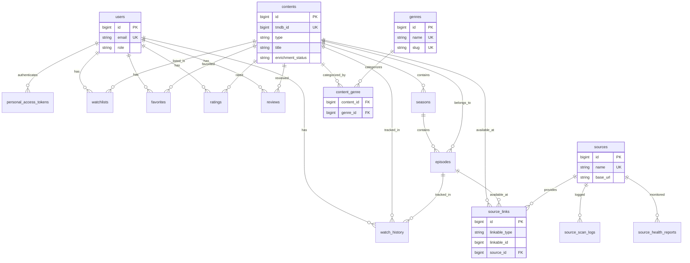

# Flixarion — Database Architecture

**Database**: PostgreSQL 15+ · **18 tables** · **6 domains**

---

## Entity Relationship Diagram

---

## Domain 1 — Users & Auth

### 1. `users`

| Column | Type | Constraints |
|--------|------|-------------|
| `id` | `bigint` | PK, AUTO |
| `name` | `varchar(255)` | NOT NULL |
| `email` | `varchar(255)` | UNIQUE, NOT NULL |
| `email_verified_at` | `timestamp` | NULL |
| `password` | `varchar(255)` | NOT NULL |
| `role` | `varchar(50)` | DEFAULT `'user'` |
| `is_banned` | `boolean` | DEFAULT `false` |
| `remember_token` | `varchar(100)` | NULL |
| `created_at` | `timestamp` | |
| `updated_at` | `timestamp` | |

**Indexes**: `UNIQUE(email)`

---

### 2. `personal_access_tokens`

Sanctum-managed. Non-expiring tokens, revoked on logout.

| Column | Type | Constraints |
|--------|------|-------------|
| `id` | `bigint` | PK, AUTO |
| `tokenable_type` | `varchar(255)` | NOT NULL |
| `tokenable_id` | `bigint` | NOT NULL |
| `name` | `varchar(255)` | NOT NULL |
| `token` | `varchar(64)` | UNIQUE |
| `abilities` | `text` | NULL |
| `expires_at` | `timestamp` | NULL |
| `last_used_at` | `timestamp` | NULL |
| `created_at` | `timestamp` | |
| `updated_at` | `timestamp` | |

**Indexes**: `UNIQUE(token)`, `INDEX(tokenable_type, tokenable_id)`

---

## Domain 2 — Content & Genres

### 3. `contents`

Unified catalog of movies and series. Deduplicated by `tmdb_id`.

| Column | Type | Constraints |
|--------|------|-------------|
| `id` | `bigint` | PK, AUTO |
| `tmdb_id` | `bigint` | UNIQUE, NOT NULL |
| `imdb_id` | `varchar(20)` | NULL |
| `type` | `varchar(50)` | NOT NULL |
| `title` | `varchar(500)` | NOT NULL |
| `original_title` | `varchar(500)` | NULL |
| `year` | `integer` | NULL |
| `description` | `text` | NULL |
| `poster_path` | `varchar(500)` | NULL |
| `backdrop_path` | `varchar(500)` | NULL |
| `cast` | `jsonb` | NULL |
| `director` | `varchar(255)` | NULL |
| `rating` | `decimal(3,1)` | NULL |
| `vote_count` | `integer` | NULL |
| `runtime` | `integer` | NULL |
| `trailer_url` | `varchar(500)` | NULL |
| `alternative_titles` | `jsonb` | NULL |
| `language` | `varchar(10)` | NULL |
| `status` | `varchar(50)` | NULL |
| `enrichment_status` | `varchar(50)` | DEFAULT `'pending'` |
| `confidence_score` | `decimal(5,2)` | NULL |
| `is_published` | `boolean` | DEFAULT `false` |
| `is_featured` | `boolean` | DEFAULT `false` |
| `watch_count` | `integer` | DEFAULT `0` |
| `created_at` | `timestamp` | |
| `updated_at` | `timestamp` | |

**Indexes**: `UNIQUE(tmdb_id)`, `INDEX(type, year, rating, title, enrichment_status)`, `GIN(alternative_titles)`, `GIN(cast)`

---

### 4. `genres`

~20 rows, seeded on migration. Maps to TMDb genre IDs.

| Column | Type | Constraints |
|--------|------|-------------|
| `id` | `bigint` | PK, AUTO |
| `name` | `varchar(100)` | UNIQUE, NOT NULL |
| `slug` | `varchar(100)` | UNIQUE, NOT NULL |
| `tmdb_id` | `integer` | UNIQUE, NULL |
| `created_at` | `timestamp` | |
| `updated_at` | `timestamp` | |

---

### 5. `content_genre`

Pivot table. Composite PK, no `id` column.

| Column | Type | Constraints |
|--------|------|-------------|
| `content_id` | `bigint` | FK → `contents.id` CASCADE |
| `genre_id` | `bigint` | FK → `genres.id` CASCADE |
| `created_at` | `timestamp` | DEFAULT `NOW()` |

**Indexes**: `PK(content_id, genre_id)`, `INDEX(genre_id)`

---

## Domain 3 — Content Hierarchy

### 6. `seasons`

| Column | Type | Constraints |
|--------|------|-------------|
| `id` | `bigint` | PK, AUTO |
| `content_id` | `bigint` | FK → `contents.id` CASCADE |
| `season_number` | `integer` | NOT NULL |
| `tmdb_season_id` | `bigint` | NULL |
| `title` | `varchar(255)` | NULL |
| `poster_path` | `varchar(500)` | NULL |
| `overview` | `text` | NULL |
| `episode_count` | `integer` | NULL |
| `air_date` | `date` | NULL |
| `created_at` | `timestamp` | |
| `updated_at` | `timestamp` | |

**Indexes**: `UNIQUE(content_id, season_number)`

---

### 7. `episodes`

| Column | Type | Constraints |
|--------|------|-------------|
| `id` | `bigint` | PK, AUTO |
| `season_id` | `bigint` | FK → `seasons.id` CASCADE |
| `content_id` | `bigint` | FK → `contents.id` CASCADE |
| `episode_number` | `integer` | NOT NULL |
| `title` | `varchar(255)` | NULL |
| `tmdb_episode_id` | `bigint` | NULL |
| `overview` | `text` | NULL |
| `still_path` | `varchar(500)` | NULL |
| `runtime` | `integer` | NULL |
| `air_date` | `date` | NULL |
| `created_at` | `timestamp` | |
| `updated_at` | `timestamp` | |

**Indexes**: `UNIQUE(season_id, episode_number)`, `INDEX(content_id)`

---

## Domain 4 — Sources & Scanning

### 8. `sources`

BDIX FTP server definitions.

| Column | Type | Constraints |
|--------|------|-------------|
| `id` | `bigint` | PK, AUTO |
| `name` | `varchar(255)` | UNIQUE, NOT NULL |
| `base_url` | `varchar(500)` | NOT NULL |
| `scraper_type` | `varchar(100)` | NOT NULL |
| `config` | `jsonb` | NULL |
| `is_active` | `boolean` | DEFAULT `true` |
| `health_score` | `decimal(5,2)` | DEFAULT `100.00` |
| `priority` | `integer` | DEFAULT `0` |
| `last_scan_at` | `timestamp` | NULL |
| `created_at` | `timestamp` | |
| `updated_at` | `timestamp` | |

---

### 9. `source_links`

Polymorphic — maps FTP files to `contents` or `episodes`.

| Column | Type | Constraints |
|--------|------|-------------|
| `id` | `bigint` | PK, AUTO |
| `linkable_type` | `varchar(50)` | NOT NULL |
| `linkable_id` | `bigint` | NOT NULL |
| `source_id` | `bigint` | FK → `sources.id` CASCADE |
| `file_path` | `varchar(2048)` | NOT NULL |
| `quality` | `varchar(50)` | NULL |
| `file_size` | `bigint` | NULL |
| `codec_info` | `varchar(100)` | NULL |
| `part_number` | `integer` | NULL |
| `subtitle_paths` | `jsonb` | NULL |
| `status` | `varchar(50)` | DEFAULT `'pending'` |
| `last_verified_at` | `timestamp` | NULL |
| `created_at` | `timestamp` | |
| `updated_at` | `timestamp` | |

**Indexes**: `INDEX(linkable_type, linkable_id, status)`, `INDEX(source_id)`

---

### 10. `shadow_content_sources`

Temp table for Phase 1 scan results. Cleared after batch sync.

| Column | Type | Constraints |
|--------|------|-------------|
| `id` | `bigint` | PK, AUTO |
| `source_id` | `bigint` | FK → `sources.id` CASCADE |
| `raw_filename` | `varchar(2048)` | NOT NULL |
| `file_path` | `varchar(2048)` | NOT NULL |
| `file_extension` | `varchar(10)` | NOT NULL |
| `file_size` | `bigint` | NULL |
| `detected_encoding` | `varchar(50)` | NULL |
| `subtitle_paths` | `jsonb` | NULL |
| `scan_batch_id` | `varchar(100)` | NOT NULL |
| `created_at` | `timestamp` | |

**Indexes**: `INDEX(source_id)`, `INDEX(scan_batch_id)`

---

### 11. `source_scan_logs`

Audit trail for Collector (Phase 1) and Enricher (Phase 2) jobs. 90-day retention.

| Column | Type | Constraints |
|--------|------|-------------|
| `id` | `bigint` | PK, AUTO |
| `source_id` | `bigint` | FK → `sources.id` CASCADE |
| `phase` | `varchar(20)` | NOT NULL |
| `status` | `varchar(50)` | NOT NULL |
| `items_found` | `integer` | DEFAULT `0` |
| `items_matched` | `integer` | DEFAULT `0` |
| `items_failed` | `integer` | DEFAULT `0` |
| `error_log` | `text` | NULL |
| `started_at` | `timestamp` | NOT NULL |
| `completed_at` | `timestamp` | NULL |

**Indexes**: `INDEX(source_id)`, `INDEX(started_at)`

---

## Domain 5 — User Activity

### 12. `watchlists`

| Column | Type | Constraints |
|--------|------|-------------|
| `id` | `bigint` | PK, AUTO |
| `user_id` | `bigint` | FK → `users.id` CASCADE |
| `content_id` | `bigint` | FK → `contents.id` CASCADE |
| `created_at` | `timestamp` | |

**Indexes**: `UNIQUE(user_id, content_id)`

---

### 13. `favorites`

| Column | Type | Constraints |
|--------|------|-------------|
| `id` | `bigint` | PK, AUTO |
| `user_id` | `bigint` | FK → `users.id` CASCADE |
| `content_id` | `bigint` | FK → `contents.id` CASCADE |
| `created_at` | `timestamp` | |

**Indexes**: `UNIQUE(user_id, content_id)`

---

### 14. `watch_history`

Trigger-only — one row per "Play" click. No playback position.

| Column | Type | Constraints |
|--------|------|-------------|
| `id` | `bigint` | PK, AUTO |
| `user_id` | `bigint` | FK → `users.id` CASCADE |
| `content_id` | `bigint` | FK → `contents.id` CASCADE |
| `episode_id` | `bigint` | FK → `episodes.id` SET NULL, NULL |
| `is_completed` | `boolean` | DEFAULT `false` |
| `played_at` | `timestamp` | DEFAULT `NOW()` |

**Indexes**: `INDEX(user_id, played_at DESC)`

---

### 15. `ratings` *(Post-MVP)*

| Column | Type | Constraints |
|--------|------|-------------|
| `id` | `bigint` | PK, AUTO |
| `user_id` | `bigint` | FK → `users.id` CASCADE |
| `content_id` | `bigint` | FK → `contents.id` CASCADE |
| `score` | `integer` | CHECK `1–10` |
| `created_at` | `timestamp` | |
| `updated_at` | `timestamp` | |

**Indexes**: `UNIQUE(user_id, content_id)`

---

### 16. `reviews` *(Post-MVP)*

| Column | Type | Constraints |
|--------|------|-------------|
| `id` | `bigint` | PK, AUTO |
| `user_id` | `bigint` | FK → `users.id` CASCADE |
| `content_id` | `bigint` | FK → `contents.id` CASCADE |
| `body` | `text` | NOT NULL |
| `created_at` | `timestamp` | |
| `updated_at` | `timestamp` | |

**Indexes**: `UNIQUE(user_id, content_id)`, `INDEX(content_id)`

---

## Domain 6 — Health Monitoring & System

### 17. `source_health_reports`

Crowdsourced ISP reachability. No IP addresses stored. 30-day retention, monthly partitions.

| Column | Type | Constraints |
|--------|------|-------------|
| `id` | `bigint` | PK, AUTO |
| `source_id` | `bigint` | FK → `sources.id` CASCADE |
| `isp_name` | `varchar(100)` | NOT NULL |
| `is_reachable` | `boolean` | NOT NULL |
| `response_time_ms` | `integer` | NULL |
| `reported_at` | `timestamp` | DEFAULT `NOW()` |

**Indexes**: `INDEX(source_id, isp_name)`, `INDEX(reported_at)`

---

### 18. `settings`

Admin-editable key-value config.

| Column | Type | Constraints |
|--------|------|-------------|
| `id` | `bigint` | PK, AUTO |
| `key` | `varchar(255)` | UNIQUE, NOT NULL |
| `value` | `text` | NULL |
| `type` | `varchar(20)` | DEFAULT `'string'` |
| `created_at` | `timestamp` | |
| `updated_at` | `timestamp` | |

---

## Relationships

| Parent | Child | Type | ON DELETE |
|--------|-------|------|----------|
| `users` | `personal_access_tokens` | 1:N | CASCADE |
| `users` | `watchlists` | 1:N | CASCADE |
| `users` | `favorites` | 1:N | CASCADE |
| `users` | `watch_history` | 1:N | CASCADE |
| `users` | `ratings` | 1:N | CASCADE |
| `users` | `reviews` | 1:N | CASCADE |
| `contents` | `seasons` | 1:N | CASCADE |
| `contents` | `content_genre` | 1:N | CASCADE |
| `contents` | `source_links` | 1:N poly | DB trigger |
| `contents` | `watchlists` | 1:N | CASCADE |
| `contents` | `favorites` | 1:N | CASCADE |
| `contents` | `watch_history` | 1:N | CASCADE |
| `contents` | `ratings` | 1:N | CASCADE |
| `contents` | `reviews` | 1:N | CASCADE |
| `contents` | `episodes` | 1:N | CASCADE |
| `genres` | `content_genre` | 1:N | CASCADE |
| `seasons` | `episodes` | 1:N | CASCADE |
| `episodes` | `source_links` | 1:N poly | DB trigger |
| `episodes` | `watch_history` | 1:N | SET NULL |
| `sources` | `source_links` | 1:N | CASCADE |
| `sources` | `shadow_content_sources` | 1:N | CASCADE |
| `sources` | `source_scan_logs` | 1:N | CASCADE |
| `sources` | `source_health_reports` | 1:N | CASCADE |

---

## Data Retention

| Table | Keep | Prune Method |
|-------|------|-------------|
| `source_scan_logs` | 90 days | Scheduled job |
| `source_health_reports` | 30 days | Partition drop |
| `shadow_content_sources` | Per scan | Cleared after sync |
| Everything else | Indefinite | — |

---

## Caching (Redis)

| Key | TTL |
|-----|-----|
| `contents:list:*` | 1 hr |
| `contents:detail:{id}` | 24 hrs |
| `user:{id}:library` | 5 min |
| `user:{id}:recently_watched` | 5 min |
| `sources:health:consensus` | 30 min |
| `trending:*` / `popular:*` | 1 hr |
| `enrichment:stats` | 1 min |
| `enrichment:paused` | ∞ |
| `settings:*` | Until flush |

---

## Design Decisions

| Decision | Choice |
|----------|--------|
| Content dedup anchor | `tmdb_id` (not `imdb_id`) |
| Source links | Single polymorphic table for movies + episodes |
| Polymorphic FK integrity | DB triggers + Eloquent `deleting()` backup |
| Genres | Normalized pivot for backend filtering |
| Watch history | Trigger-only, no playback position |
| Recently watched | Redis cache (not JSONB on users) |
| `watch_count` | `WatchHistoryObserver::created()` increment |
| Scan strategy | Shadow table → batch sync |
| Health monitoring | Crowdsourced, monthly partitions |
| ISP detection | Client-side only (Service Worker) |
| Settings casting | `type` column for validation |
| Watchlists/Favorites | No `updated_at` — `const UPDATED_AT = null` |
