# Flixarion — Project Master Plan

> **SCOPE NOTE: This repository (Flixarion) is strictly the Laravel Backend API. All Frontend (Next.js) and Admin Panel (Vue.js) components have been moved to separate repositories and their implementation scope is excluded from this codebase.**


> **A full-stack movie & TV series streaming platform aggregating content from Bangladesh BDIX FTP servers, delivering a Netflix-like experience.**

**Version**: 1.1  
**Created**: 2026-02-17  
**Project Timeline**: 11 weeks (MVP)

---

## 1. Project Overview

**Flixarion** is a modern, full-stack streaming platform built specifically for Bangladesh users connected to BDIX (Bangladesh Internet Exchange). The platform aggregates movie and TV series content from multiple BDIX FTP servers, enriches them with rich metadata from TMDb/OMDb, and delivers a premium Netflix-like browsing and streaming experience.

### Core Value Proposition

- 🎬 **Aggregated Content** — Unified library from 6+ BDIX FTP servers
- ⚡ **Direct Streaming** — Video streams directly from FTP to browser (zero backend bottleneck)
- 🔍 **Rich Metadata** — Posters, descriptions, cast, trailers via TMDb/OMDb APIs
- 🌐 **ISP-Aware** — Smart source detection based on user's ISP/network
- 📊 **Admin Control** — Full admin panel for source, content, and user management

---

## 2. Tech Stack

| Layer | Technology | Version | Purpose |
|-------|-----------|---------|---------|
| **Backend API** | Laravel | 12.x | REST API, queue jobs, scanning |
| **Frontend** | Next.js | 14.x (App Router) | User-facing streaming UI |
| **Admin Panel** | Vue.js | 3.x (Composition API) | Admin dashboard & management |
| **Database** | PostgreSQL | 15+ | Primary data store |
| **Cache/Queue** | Redis | 7.x | Caching + Laravel Queue backend |
| **Video Player** | Plyr.js + hls.js | Latest | HLS/MP4/MKV playback |

### Why This Stack?

- **Laravel**: Mature PHP framework with built-in queue, scheduler, and ORM — ideal for the scanning/scraping pipeline
- **Next.js 14**: App Router provides SSR/SSG for SEO, React Server Components for performance
- **Vue.js 3**: Lightweight, fast admin panel with Composition API + Pinia state management
- **PostgreSQL**: JSONB support for flexible metadata, array columns for genres, robust indexing
- **Redis**: Sub-millisecond caching, reliable queue backend for scan jobs
- **Plyr.js + hls.js**: Lightweight (~30KB), HLS/m3u8 streaming support, quality switching, subtitle support

---

## 3. System Architecture


### Data Flow Summary

```
Client-Triggered Scan:
User visits → Frontend Race Strategy → Reachable FTPs identified
→ Web Worker reads FTP directory listings (background, non-blocking)
→ POSTs new file list to API → Backend saves to shadow_content_sources
→ Enricher processes (TMDb/OMDb) → PostgreSQL → Redis Cache → API → User

Admin Manual Scan:
Admin (on BDIX network) → Triggers scan from admin panel
→ Backend scraper connects to FTP directly → Same enrichment pipeline

Note: The server is NOT on BDIX. It cannot reach FTP sources directly.
Only BDIX-connected users/admins can trigger scans.
```

> **Key Design Decision**: Video content is streamed **directly** from BDIX FTP servers to the user's browser. The Laravel backend only manages metadata and source URLs — it never proxies video data.

---

## 4. Content Sources (BDIX FTP Servers)

### 4.1 Source Registry

| # | Source | Base URL | CDN URLs | Type | Status | Complexity |
|---|--------|----------|----------|------|--------|------------|
| 1 | **Dflix** | `https://movies.discoveryftp.net` | `cdn1.discoveryftp.net`, `cdn2.discoveryftp.net` | HTTP Scraper | ✅ Online | Medium |
| 2 | **DhakaFlix (Movie)** | `http://172.16.50.14` | — | JSON API | ✅ Online | Low |
| 3 | **DhakaFlix (Series)** | `http://172.16.50.12` | — | JSON API | ✅ Online | Low |
| 4 | **RoarZone** | `https://play.roarzone.info` | — | Emby API | ✅ Online | Medium |
| 5 | **FTPBD** | `http://media.ftpbd.net:8096` | — | Emby API | ❌ Offline | Medium |
| 6 | **CircleFTP** | `http://new.circleftp.net:5000/api` | Web: `http://new.circleftp.net` | REST API | ⚠️ Partial | Medium |
| 7 | **ICC FTP** | `http://10.16.100.244` | — | Multi-step AJAX | ✅ Online | High |
8 | **ihub** | `http://ihub.live/` | 
### 4.2 Implementation Priority

- **Phase 1** (High Priority): DhakaFlix (Movie + Series), Dflix, ICC FTP — all confirmed online
- **Phase 2** (Medium Priority): RoarZone, CircleFTP — require auth/endpoint testing
- **Phase 3** (Low Priority): FTPBD — currently unreachable, investigate first

### 4.3 Source Scraping Details

#### Dflix — HTTP Scraper

**Search:**
```http
POST https://movies.discoveryftp.net/search
Content-Type: application/x-www-form-urlencoded

term=inception&types=m
# types: m=movie, s=series
```

**Flow:** Search → Parse HTML results → Scrape detail page → Extract `.mkv`/`.mp4` download links from CDN URLs.  
**Stream URL format:** `https://cdn1.discoveryftp.net/Movies/Inception.2010.1080p.BluRay.mkv`

---

#### DhakaFlix — JSON API

**Search (Movie Server):**
```http
POST http://172.16.50.14/DHAKA-FLIX-14/
Content-Type: application/json

{
  "action": "get",
  "search": {
    "href": "/DHAKA-FLIX-14/",
    "pattern": "inception",
    "ignorecase": true
  }
}
```

**Response:**
```json
{
  "search": [
    {
      "href": "/DHAKA-FLIX-14/Movies/Inception (2010)/Inception.2010.1080p.BluRay.x264.mkv",
      "size": 2048576000
    }
  ]
}
```

**Data extracted:** `href` → streaming URL, `size` → file size, filename → title/year/quality.  
**Series server** (`172.16.50.12`) uses same API format.

---

#### RoarZone — Emby API

**Step 1: Authenticate**
```http
POST https://play.roarzone.info/emby/Users/AuthenticateByName
X-Emby-Authorization: MediaBrowser Client="Flixarion", Device="Scanner", DeviceId="flixarion-001", Version="1.0.0"
Content-Type: application/json

{ "Username": "RoarZone_Guest", "Pw": "" }
```

**Response:** `{ "AccessToken": "abc123...", "User": { "Id": "user123" } }`

**Step 2: Search by IMDb ID**
```http
GET https://play.roarzone.info/emby/Items?AnyProviderIdEquals=imdb.tt1375666&IncludeItemTypes=Movie&Recursive=true&Fields=MediaSources,ProviderIds,Path&api_key=TOKEN
```

**Response** contains `Items[].Id`, `Items[].ProviderIds.Imdb`, `Items[].MediaSources[].Path`, `Size`.

**Stream URL format:** `https://play.roarzone.info/emby/Videos/{ItemId}/stream?Static=true&api_key={TOKEN}`

**Series episodes:**
```http
GET https://play.roarzone.info/emby/Shows/{SeriesId}/Episodes?Season=1&Fields=MediaSources,Path&api_key=TOKEN
```

---

#### FTPBD — Emby API

Same Emby API pattern as RoarZone, but with:
- **Base URL:** `http://media.ftpbd.net:8096`
- **Username:** `BNET- -USER`
- **Password:** (empty)
- Falls back to name-based search if IMDb search fails
- **Status:** Currently offline — investigate before implementing

---

#### CircleFTP — REST API

**Search:**
```http
GET http://new.circleftp.net:5000/api/posts?searchTerm=inception&order=desc
```

**Response:**
```json
{
  "posts": [
    {
      "id": "123",
      "type": "singleVideo",
      "name": "Inception",
      "title": "Inception (2010)",
      "year": "2010",
      "quality": "1080p BluRay"
    }
  ]
}
```

**Get details:** `GET /api/posts/123`  
- Movie response: `{ "content": "http://link.to/video.mp4" }`
- Series response: `{ "content": [{ "seasonName": "Season 1", "episodes": [{ "title": "S01E01", "link": "http://..." }] }] }`

---

#### ICC FTP — Multi-Step AJAX

**Step 1: Get search context**
```http
GET http://10.16.100.244/advancedsrch.php?modal=1
```
→ Returns HTML with `token` and `key` values.

**Step 2: Search**
```http
POST http://10.16.100.244/command.php
Content-Type: application/x-www-form-urlencoded

cSearch=inception
```
→ Response: `[{ "id": "123", "name": "Inception (2010)" }]`

**Step 3: Extract streams**
```http
GET http://10.16.100.244/player.php?play=123
```
→ Returns HTML with `<source src='URL' title='TITLE'>` tags containing direct stream URLs.

---

## 5. Content Matching & Filename Parsing

### 5.1 The Challenge

BDIX FTP servers use inconsistent naming conventions with no structured metadata. All content identification must be derived from filenames:
- `Inception.2010.1080p.BluRay.x264.mkv`
- `Breaking Bad S01E01 720p WEB-DL.mkv`
- `The.Dark.Knight.2008.2160p.UHD.BluRay.x265.mkv`

### 5.2 Parsing Algorithm

```
1. Extract YEAR → regex: /\b(19|20)\d{2}\b/
2. Extract QUALITY → regex: /\b(2160p|1080p|720p|480p|4k|uhd)\b/i
3. Check for SERIES pattern → regex: /S(\d{1,2})E(\d{1,2})/i
   - If match → type = "series", extract season + episode number
   - Title = everything before S##E## pattern
4. If no series pattern → type = "movie"
   - Title = everything before the year
5. CLEAN title → replace dots/underscores/dashes with spaces, collapse whitespace, trim
```

**Parsing Examples:**

| Filename | Parsed Result |
|----------|---------------|
| `Inception.2010.1080p.BluRay.mkv` | `{title: "Inception", year: 2010, quality: "1080p", type: "movie"}` |
| `Breaking.Bad.S01E01.720p.mkv` | `{title: "Breaking Bad", season: 1, episode: 1, quality: "720p", type: "series"}` |
| `The Dark Knight 2008 2160p.mkv` | `{title: "The Dark Knight", year: 2008, quality: "2160p", type: "movie"}` |

### 5.3 Metadata Enrichment Strategy

After parsing, the system fetches rich metadata:

1. **Try TMDb first** (primary)
   - Movies: `GET https://api.themoviedb.org/3/search/movie?api_key={KEY}&query={title}&year={year}`
   - Series: `GET https://api.themoviedb.org/3/search/tv?api_key={KEY}&query={title}`
   - Details: `GET https://api.themoviedb.org/3/movie/{tmdb_id}?append_to_response=credits,videos`
   - Season: `GET https://api.themoviedb.org/3/tv/{id}/season/{num}`
   - Image base: `https://image.tmdb.org/t/p/{size}/{path}` (sizes: `w500`, `original`)
2. **Fallback to OMDb**
   - `GET https://www.omdbapi.com/?apikey={KEY}&t={title}&y={year}`
3. **If both fail** → Log as unmatched content for admin review

### 5.4 Quality Scoring (for source ranking)

```
Quality scores (× 10):  4K/2160p=4, 1080p=3, 720p=2, 480p=1, unknown=0

Source quality bonus:
  IMAX=20, BluRay=18, BRRip=17, WEB-DL=16, WebRip=15,
  HDRip=14, HDTV=13, DVDRip=12, HDR=10, SDR=9,
  Dolby Atmos=8, DDP5.1=7, 7.1=6, 5.1=5, AAC=4

Final score = (quality × 10) + source_bonus
Example: "1080p BluRay Dolby Atmos" = (3×10) + 18 + 8 = 56
```

---

## 6. Database Schema

> Full schema details in [database_architecture.md](file:///Volumes/WD%20M.2/BluBird/Flixarion/docs/database_architecture.md). This section provides a summary.

**18 tables** across 6 domains: Users & Auth, Content, Sources & Scanning, User Activity, Health Monitoring, System.

### 6.1 Entity Relationship


### 6.2 Table Summary

| # | Table | Key Columns | Notes |
|---|-------|-------------|-------|
| 1 | `users` | id, name, email, password, role, is_banned | Sanctum auth. Recently watched cached in Redis, not DB |
| 2 | `personal_access_tokens` | tokenable_id, token, expires_at | Sanctum managed. Non-expiring, revoked on logout |
| 3 | `contents` | tmdb_id (UK), type, title, year, rating, enrichment_status, confidence_score, is_published, is_featured, cast (JSONB), alternative_titles (JSONB) | Deduped by tmdb_id |
| 4 | `genres` | name (UK), slug (UK), tmdb_id | ~20 rows, seeded |
| 5 | `content_genre` | content_id (FK), genre_id (FK) | Composite PK, no id column |
| 6 | `seasons` | content_id (FK), season_number, tmdb_season_id | UNIQUE(content_id, season_number) |
| 7 | `episodes` | season_id (FK), content_id (FK), episode_number, tmdb_episode_id | UNIQUE(season_id, episode_number) |
| 8 | `sources` | name (UK), base_url, scraper_type, config (JSONB), is_active, health_score, priority | BDIX server definitions |
| 9 | `source_links` | linkable_type, linkable_id, source_id (FK), file_path, quality, codec_info, subtitle_paths (JSONB), status | Polymorphic: 'content' or 'episode' |
| 10 | `shadow_content_sources` | source_id, raw_filename, file_path, file_extension, scan_batch_id | Temp table for Phase 1 scans |
| 11 | `source_scan_logs` | source_id (FK), phase, status, items_found, items_matched, items_failed | 90-day retention |
| 12 | `watchlists` | user_id (FK), content_id (FK) | UNIQUE(user_id, content_id) |
| 13 | `favorites` | user_id (FK), content_id (FK) | UNIQUE(user_id, content_id) |
| 14 | `watch_history` | user_id (FK), content_id (FK), episode_id (FK nullable), is_completed, played_at | Trigger-only, no playback position |
| 15 | `ratings` | user_id (FK), content_id (FK), score (1–10) | Post-MVP |
| 16 | `reviews` | user_id (FK), content_id (FK), body | Post-MVP |
| 17 | `source_health_reports` | source_id (FK), isp_name, is_reachable, response_time_ms, reported_at | 30-day rolling window, no IPs |
| 18 | `settings` | key (UK), value | Admin-editable config |

### 6.3 Key Design Decisions

| Decision | Choice | Rationale |
|----------|--------|-----------|
| Content anchor | `tmdb_id` (not `imdb_id`) | Stable, prevents duplicates across sources |
| Source links | Polymorphic `source_links` table | Single table for both movie and episode sources, eliminates duplication |
| Genres | Normalized `genres` + `content_genre` pivot | Enables efficient backend-side filtering and aggregation |
| Watch history | Trigger-only (no position) | Reduces DB writes and I/O under load |
| Recently watched | JSON column on `users` (last 10) | Fast retrieval, no complex JOINs |
| Scan strategy | Shadow table → batch sync | Prevents UI sluggishness during 6h scans |
| Source health | Crowdsourced `source_health_reports` | Admin server can't reach BDIX IPs directly |
| ISP detection | Client-side only (Service Worker) | No per-user source table needed on backend |
| Content match | Confidence score (0–100%) | <80% flagged for review, not auto-published |

---

## 7. API Architecture

### 7.1 Authentication (`/api/auth`)

| Method | Endpoint | Description |
|--------|----------|-------------|
| POST | `/register` | User registration |
| POST | `/login` | User login (returns Sanctum token) |
| POST | `/logout` | User logout (revokes token) |
| GET | `/me` | Get authenticated user |

### 7.2 Content (`/api/contents`)

| Method | Endpoint | Description |
|--------|----------|-------------|
| GET | `/` | Paginated, filterable content list |
| GET | `/{id}` | Content detail with sources |
| GET | `/{id}/sources` | Available sources for content |
| GET | `/{id}/seasons` | Seasons (series only) |
| GET | `/search` | Full-text search |
| GET | `/trending` | Trending content |
| GET | `/popular` | Popular content |
| GET | `/recent` | Recently added |

**Content filtering params:** `type`, `genre`, `year`, `available_only` (filters by user's accessible sources)

### 7.3 Episodes (`/api/episodes`)

| Method | Endpoint | Description |
|--------|----------|-------------|
| GET | `/{id}` | Episode details |
| GET | `/{id}/sources` | Available sources for episode |

### 7.4 User Library (`/api/user`)

| Method | Endpoint | Description |
|--------|----------|-------------|
| GET | `/watchlist` | Get user's watchlist |
| POST | `/watchlist` | Add to watchlist |
| DELETE | `/watchlist/{content_id}` | Remove from watchlist |
| GET | `/favorites` | Get favorites |
| POST | `/favorites` | Add to favorites |
| DELETE | `/favorites/{content_id}` | Remove from favorites |
| GET | `/history` | Get watch history |
| POST | `/history` | Update watch progress |
| GET | `/continue-watching` | Get continue watching list |

### 7.5 User Sources (`/api/user/sources`)

| Method | Endpoint | Description |
|--------|----------|-------------|
| GET | `/` | Get user's accessible sources |
| POST | `/test` | Save source availability test results |
| POST | `/{id}/toggle` | Enable/disable a source |
| POST | `/{id}/set-preferred` | Set preferred source |

### 7.6 Ratings & Reviews (`/api/contents/{id}`) — *Post-MVP*

| Method | Endpoint | Description |
|--------|----------|-------------|
| POST | `/rate` | Rate content (1–10) |
| POST | `/review` | Write a review |
| GET | `/reviews` | Get reviews list |

### 7.7 Admin (`/api/admin`)

| Method | Endpoint | Description |
|--------|----------|-------------|
| GET | `/dashboard` | Dashboard statistics |
| GET | `/sources` | List all sources |
| POST | `/sources` | Add new source |
| PUT | `/sources/{id}` | Update source |
| DELETE | `/sources/{id}` | Delete source |
| POST | `/sources/{id}/scan` | Trigger manual scan |
| GET | `/sources/{id}/logs` | View scan logs |
| GET | `/contents` | Manage content list |
| POST | `/contents/{id}/sync` | Force metadata sync |
| GET | `/users` | User management |
| GET | `/analytics` | Platform analytics |

---

## 8. Core Workflows

### 8.1 Content Scanning Pipeline


### 8.2 ISP Source Detection (First-Time User)

```mermaid
sequenceDiagram
    participant U as User
    participant F as Frontend
    participant S as FTP Sources
    participant B as Backend

    U->>F: Opens App (First Time)
    F->>U: Show Source Detection Wizard
    U->>F: Click "Detect Sources"
    
    loop For Each Source
        F->>S: Test Connectivity (Image/XHR)
        S-->>F: Success/Failure + Ping
    end
    
    F->>B: POST /api/sources/health-report
    B->>B: Save to source_health_reports (anonymous)
    B-->>F: Success
    F->>U: Show Results → Continue to Browse
```



**Client-side testing approach:**
- Use `Image` loading or `fetch` with `no-cors` mode
- 5-second timeout per source
- Measure ping as `Date.now()` delta

### 8.3 User Content Discovery


### 8.4 Video Playback


### 8.5 Admin Source Management


---

## 9. Project Structure

### Backend (Laravel)

```
flixarion-api/
├── app/
│   ├── Console/Commands/
│   │   ├── ScanAllSources.php
│   │   └── SyncMetadata.php
│   ├── Http/
│   │   ├── Controllers/
│   │   │   ├── AuthController.php
│   │   │   ├── ContentController.php
│   │   │   ├── EpisodeController.php
│   │   │   ├── UserLibraryController.php
│   │   │   └── Admin/
│   │   │       ├── SourceController.php
│   │   │       ├── ContentController.php
│   │   │       ├── UserController.php
│   │   │       └── AnalyticsController.php
│   │   ├── Middleware/
│   │   │   ├── AdminMiddleware.php
│   │   │   └── SanctumMiddleware.php
│   │   └── Requests/
│   │       ├── LoginRequest.php
│   │       ├── RegisterRequest.php
│   │       └── Admin/
│   │           └── SourceRequest.php
│   ├── Models/
│   │   ├── User.php
│   │   ├── Content.php
│   │   ├── Season.php
│   │   ├── Episode.php
│   │   ├── Source.php
│   │   ├── ContentSource.php
│   │   ├── EpisodeSource.php
│   │   ├── WatchHistory.php
│   │   ├── Watchlist.php
│   │   ├── Favorite.php
│   │   ├── Rating.php
│   │   ├── Review.php
│   │   ├── SourceScanLog.php
│   │   ├── UserSource.php
│   │   └── SourceUsageLog.php
│   ├── Services/
│   │   ├── MetadataService.php
│   │   ├── SourceScannerService.php
│   │   ├── ContentMatchingService.php
│   │   └── Scrapers/
│   │       ├── BaseScraperInterface.php
│   │       ├── DflixScraper.php
│   │       ├── DhakaFlixScraper.php
│   │       ├── RoarZoneScraper.php
│   │       ├── FTPBDScraper.php
│   │       ├── CircleFTPScraper.php
│   │       └── ICCFTPScraper.php
│   └── Jobs/
│       ├── ScanSourceJob.php
│       ├── SyncContentMetadataJob.php
│       └── UpdateSourceHealthJob.php
├── database/
│   ├── migrations/
│   └── seeders/
├── routes/
│   ├── api.php
│   └── web.php
├── config/
│   ├── sources.php
│   └── metadata.php
└── .env
```

### Frontend (Next.js)

```
flixarion-web/
├── src/
│   ├── app/
│   │   ├── (auth)/
│   │   │   ├── login/page.tsx
│   │   │   └── register/page.tsx
│   │   ├── (main)/
│   │   │   ├── layout.tsx
│   │   │   ├── page.tsx              # Homepage
│   │   │   ├── browse/page.tsx
│   │   │   ├── search/page.tsx
│   │   │   ├── movie/[id]/page.tsx
│   │   │   ├── series/[id]/page.tsx
│   │   │   ├── watch/[id]/page.tsx
│   │   │   ├── my-list/page.tsx
│   │   │   └── continue-watching/page.tsx
│   │   └── layout.tsx
│   ├── components/
│   │   ├── layout/                    # Header, Footer, Sidebar
│   │   ├── content/                   # ContentCard, Grid, Carousel, Details, EpisodeList
│   │   ├── player/                    # VideoPlayer, QualitySelector, SubtitleSelector
│   │   ├── sources/                   # SourceDetectionWizard, SourceSelector
│   │   └── ui/                        # Button, Input, Modal
│   ├── lib/                           # api.ts, auth.ts, utils.ts
│   ├── hooks/                         # useAuth, useContent, useWatchProgress
│   └── types/index.ts
├── public/
├── next.config.js
└── package.json
```

### Admin Panel (Vue.js)

```
flixarion-admin/
├── src/
│   ├── views/
│   │   ├── Dashboard.vue
│   │   ├── sources/                   # SourceList, AddSource, EditSource, SourceLogs
│   │   ├── contents/                  # ContentList, ContentDetail
│   │   ├── users/UserList.vue
│   │   └── analytics/Analytics.vue
│   ├── components/
│   │   ├── Sidebar.vue
│   │   ├── Header.vue
│   │   ├── SourceCard.vue
│   │   ├── ContentTable.vue
│   │   ├── ScanLogTable.vue
│   │   └── charts/                    # UsageChart, SourceHealthChart
│   ├── composables/                   # useApi, useSources, useAnalytics
│   ├── router/index.ts
│   ├── store/                         # Pinia: auth, sources
│   └── services/api.ts
├── public/
└── package.json
```

---

## 10. Admin Panel Features

### Dashboard
- **Overview stats:** Total Users, Movies/Series, Sources (active/inactive), Total Storage
- **Popular content:** Most watched titles
- **Recent activity:** Registrations, content additions, scans
- **Charts:** Daily/weekly/monthly user activity, content additions over time, source health trends

### Source Management
- **List view:** All sources with health status (color-coded), last scan, items found
- **Add/Edit:** Name, type, URL, config JSON, priority, test connection before saving
- **Manual actions:** Trigger immediate scan, view scan logs, view matched/unmatched items, re-process unmatched
- **Health monitoring:** Real-time health scores

### Content Management
- **List view:** Filter by type, genre, year, availability; search by title or IMDb ID
- **Detail view:** Full metadata, available sources/qualities, manual metadata refresh
- **Actions:** Mark as featured/trending, remove content

### User Management
- **List view:** All registered users, registration date, activity stats
- **Actions:** Ban/unban, reset password
- **Detail view:** Watch history, watchlist, favorites

### Analytics
- **User analytics:** New registrations, DAU/WAU/MAU, retention rates
- **Content analytics:** Most watched, watch time, popular genres, completion rates
- **Source analytics:** Usage stats, reliability scores, average response times

### System Settings
- **Metadata config:** TMDb/OMDb API keys, sync frequency
- **Scan config:** Schedule, batch size, timeouts
- **General:** Site name, logo, default video quality, feature toggles

---

## 11. Implementation Phases

### Phase 1: Foundation (Weeks 1–2)

**Backend:**
- Set up Laravel 12 project + PostgreSQL + Redis
- Create all database migrations
- Set up Sanctum authentication + User model + auth endpoints

**Frontend:**
- Set up Next.js 14 project (App Router)
- Configure Tailwind CSS
- Create layout components (Header, Footer) + auth pages
- Configure API client

**Admin Panel:**
- Set up Vue.js 3 project + Vue Router + Pinia
- Create authentication flow + basic dashboard layout

---

### Phase 2: Metadata & Content (Weeks 3–4)

**Backend:**
- Create Content, Season, Episode models
- Implement MetadataService (TMDb + OMDb integration)
- Content API endpoints + search + filtering + pagination
- Set up metadata sync job

**Frontend:**
- Content grid/carousel components
- Homepage with trending/popular sections
- Content detail page + search
- Loading states + error handling

**Admin Panel:**
- Content list + detail views
- Manual metadata sync feature

---

### Phase 3: Source Management & Scanning (Weeks 5–6)

**Backend:**
- Create Source, ContentSource, EpisodeSource models
- Implement all BDIX scrapers (Dflix, DhakaFlix, RoarZone, CircleFTP, ICC FTP)
- SourceScannerService + ContentMatchingService (filename parsing)
- ScanSourceJob queue job + Laravel scheduler (every 6 hours)
- Admin source API endpoints

**Admin Panel:**
- Source management UI (list, add, edit, delete)
- Source configuration forms + test connection
- Manual scan trigger + scan logs viewer
- Source health monitoring dashboard

---

### Phase 4: Video Playback (Weeks 7–8)

**Backend:**
- Endpoints for fetching available sources with quality sorting
- Subtitle detection logic
- Direct download link generation
- Signed URL generation for authenticated sources

**Frontend:**
- Plyr.js + hls.js integration (m3u8, MP4, MKV support)
- Watch page with embedded player
- Quality selector + subtitle selector
- Download button
- Watch progress tracking (every 10 seconds)
- Episode navigation for series
- Auto-fallback on source failure

---

### Phase 5: User Library (Week 9)

**Backend:**
- Watchlist, Favorite, WatchHistory models + endpoints
- Continue watching logic (resume > 90% = completed)
- Cache user library data in Redis

**Frontend:**
- My Watchlist page
- Favorites page
- Continue Watching section on homepage
- Add to watchlist/favorites buttons on content pages
- Watch progress indicators

**Admin Panel:**
- User activity viewer
- User library management

---

### Phase 6: ISP Source Detection & Polish (Week 10)

**Backend:**
- UserSource model + source testing endpoints
- Content filtering by user's accessible sources
- Source usage logging

**Frontend:**
- Source Detection Wizard (first-time setup)
- Client-side connectivity testing
- Source Settings page (re-test, enable/disable, set preferred)
- Source Selector component on video player

**Optimization:**
- Redis caching strategies (see Section 14)
- Database query optimization + indexing
- API rate limiting + health check endpoints
- SEO optimization, code splitting, skeleton loaders
- Infinite scroll/pagination
- Mobile responsiveness

---

### Phase 7: Testing & Deployment (Week 11)

- Unit tests + integration tests
- End-to-end testing
- Performance testing
- Security audit
- CI/CD pipeline setup
- Production server configuration
- Monitoring setup (Laravel Telescope / New Relic)
- Deploy: backend, frontend, admin panel

---

### Phase 8: Future Enhancements (Post-Launch)

- Ratings & reviews system
- Comment system
- Social features (share, recommendations)
- Advanced analytics
- Mobile apps (React Native)
- Push notifications
- Watch party feature
- ML-based recommendation engine

---

## 12. Key Technical Decisions

| Decision | Choice | Rationale |
|----------|--------|-----------|
| Video delivery | Direct FTP → Browser | No backend bottleneck, maximum speed |
| Metadata source | TMDb primary + OMDb fallback | TMDb has rich data; OMDb for resilience |
| Scan frequency | Every 6 hours (automated) | Balance freshness vs. API rate limits |
| Content matching | Regex filename parsing | FTP servers have no structured metadata |
| ISP detection | Client-side ping/image test | Must test from user's actual network |
| Source fallback | Auto-switch on stream failure | Transparent UX when source goes down |
| Authentication | Sanctum with non-expiring tokens | Stateless, scalable, revoked on logout |
| Caching | Redis with tag-based invalidation | Fast, supports selective cache bust |
| Admin panel | Separate Vue.js app | Independent deploy, doesn't bloat user frontend |
| Database | PostgreSQL with JSONB + arrays | Flexible metadata without extra tables |

---

## 13. Error Handling

### Source Unreachable
- Mark source health score -10 per failure
- Log error with timestamp + error message
- Auto-disable source if health drops below threshold
- Admin notification for repeated failures

### Metadata Not Found
- Log unmatched content with filename, parsed title, year, source_id
- Admin can review and manually match unmatched items
- Retry with fuzzy matching on next scan cycle

### Video Stream Failure
- Frontend auto-fallback to next available source
- If all sources fail, display user-friendly error
- Log source usage failure for analytics

### Scan Job Failures
- Retry failed jobs up to 3 times with exponential backoff
- Record failure in scan_logs table
- Update source health score accordingly

---

## 14. Caching Strategy

| Data | Cache Key Pattern | TTL | Invalidation |
|------|-------------------|-----|-------------|
| Trending content | `contents.trending` | 1 hour | On content update |
| Content list (filtered) | `contents.list.{hash}` | 1 hour | Tag-based flush |
| Content detail | `content.{id}` | 24 hours | On content/source update |
| User watchlist | `user.{id}.watchlist` | 5 minutes | On add/remove |
| User favorites | `user.{id}.favorites` | 5 minutes | On add/remove |
| User sources | `user.{id}.sources` | 1 hour | On source test |
| Source health | `source.{id}.health` | 30 minutes | On health check |

---

## 15. Responsive Design

### Breakpoints

| Device | Width | Content Grid Columns |
|--------|-------|---------------------|
| Mobile | 0–640px | 2 columns |
| Tablet | 641–1024px | 3–4 columns |
| Desktop | 1025px+ | 5–6 columns |

### Key UX Guidelines
- Touch-friendly controls on mobile (gesture controls for video player)
- Collapsible sidebar navigation on mobile
- Responsive video player that adapts to viewport
- Optimized image sizes per breakpoint (Next.js `<Image>` component)

---

## 16. Performance Targets

| Metric | Target |
|--------|--------|
| Page Load Time | < 2 seconds |
| API Response (cached) | < 200 ms |
| API Response (uncached) | < 500 ms |
| Video Start Time | < 3 seconds |
| Database Query Avg | < 100 ms |
| Concurrent Users | 1,000+ (with caching) |

---

## 17. Security

- **Auth**: Sanctum non-expiring tokens (revoked on logout), bcrypt password hashing, email verification
- **Authorization**: Role-based (User, Admin) with middleware protection on admin routes
- **Validation**: Laravel Form Requests for all user inputs
- **API**: Rate limiting, CORS configuration, API key protection for TMDb/OMDb
- **FTP Sources**: URL validation before fetching, timeout configurations, error handling for unreachable sources
- **Authenticated Sources**: Signed/time-limited URLs for sources requiring auth (e.g., Emby APIs)
- **Sensitive Data**: No FTP credentials or API keys exposed to frontend
- **Client-Side ISP Testing**: Uses safe methods (Image loading / `fetch` with `no-cors`), no credentials exposed

---

## 18. Environment Configuration

### Laravel `.env`
```
APP_URL=http://localhost:8000

DB_CONNECTION=pgsql
DB_HOST=127.0.0.1
DB_PORT=5432
DB_DATABASE=flixarion
DB_USERNAME=postgres
DB_PASSWORD=

REDIS_HOST=127.0.0.1
REDIS_PASSWORD=null
REDIS_PORT=6379

QUEUE_CONNECTION=redis

TMDB_API_KEY=your_tmdb_key
OMDB_API_KEY=your_omdb_key

Sanctum_SECRET=your_sanctum_secret

FRONTEND_URL=http://localhost:3000
ADMIN_URL=http://localhost:8080
```

### Next.js `.env.local`
```
NEXT_PUBLIC_API_URL=http://localhost:8000/api
NEXT_PUBLIC_SITE_NAME=Flixarion
```

### Vue.js Admin `.env`
```
VITE_API_URL=http://localhost:8000/api
```

### Metadata API Configuration
```php
// config/metadata.php
return [
    'tmdb' => [
        'api_key'        => env('TMDB_API_KEY'),
        'base_url'       => 'https://api.themoviedb.org/3',
        'image_base_url' => 'https://image.tmdb.org/t/p',
    ],
    'omdb' => [
        'api_key'  => env('OMDB_API_KEY'),
        'base_url' => 'https://www.omdbapi.com',
    ],
];
```

---

**Document Version**: 1.1  
**Project Name**: Flixarion  
**Last Updated**: 2026-02-17  
**Total Sections**: 18
